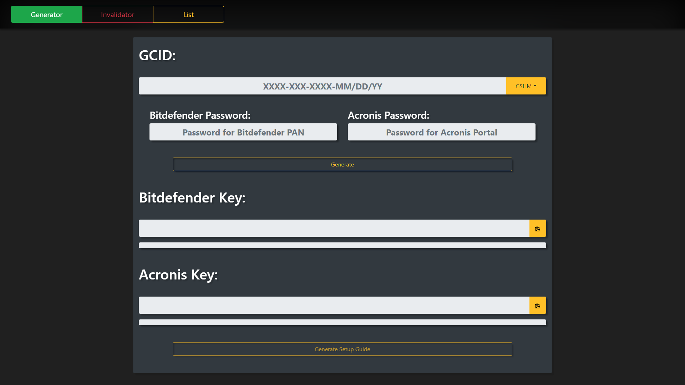

# AFK Key Generator
> As of February 2nd, 2019 this no longer works as we no longer has access to individual logins for Acronis & Bitdefender. I'm uploading this so that anyone who's interested can see how it use to work.

This generator was made prior to the Benefits portal. I've been updating it and adding aesthetic changes and features. Please let me know what you think of it.

## Dependencies
This uses a couple dependencies, all of which are already included:
1. [Bootstrap v4](https://getbootstrap.com/)
2. [jQuery](https://jquery.com/)
3. [simple-html-dom](http://simplehtmldom.sourceforge.net/)

## Directory
- [/src](/src) - Source files (sorry, it's really messy)
- [/img](/img) - Screenshots of the generator working

## Setup
1. Download all of the files in [/src](img)
2. Go into `index.js`, then replace `email@email.com` at the top with your corresponding Acronis & Bitdefender logins
3. Run on a HTTP server (Apache works best, but it will run on PHP test environment a little buggy)

## How it works
If you want to know more about how it works, [click here](/src).
