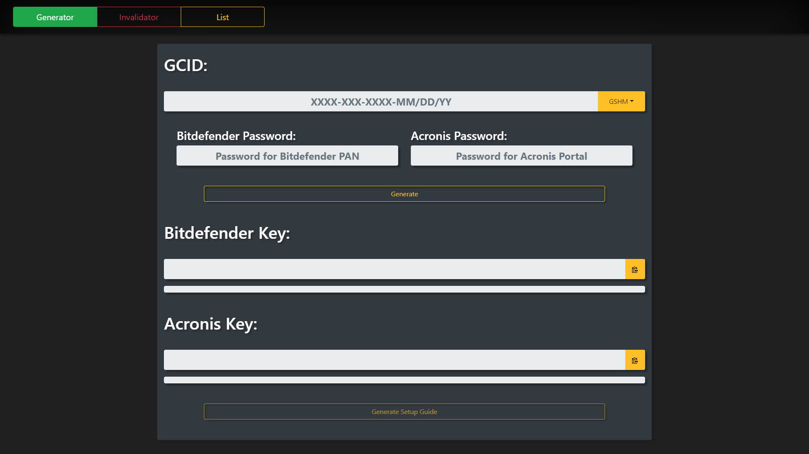
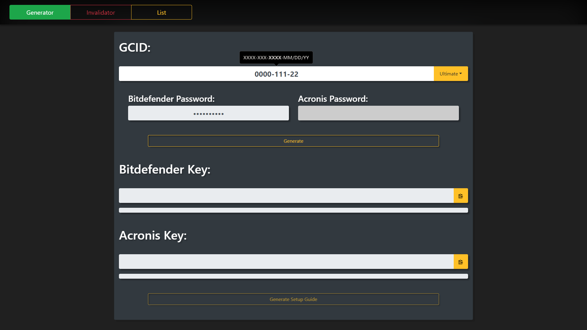
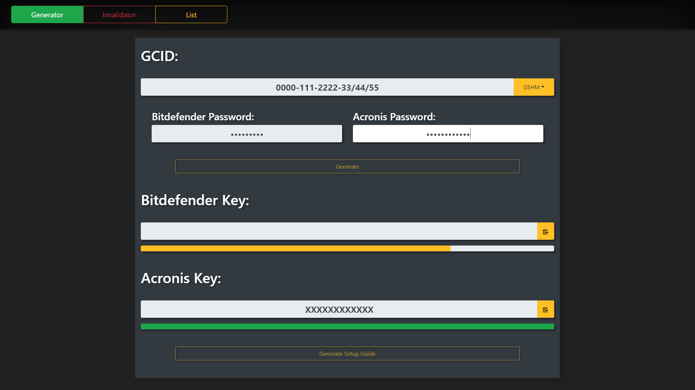
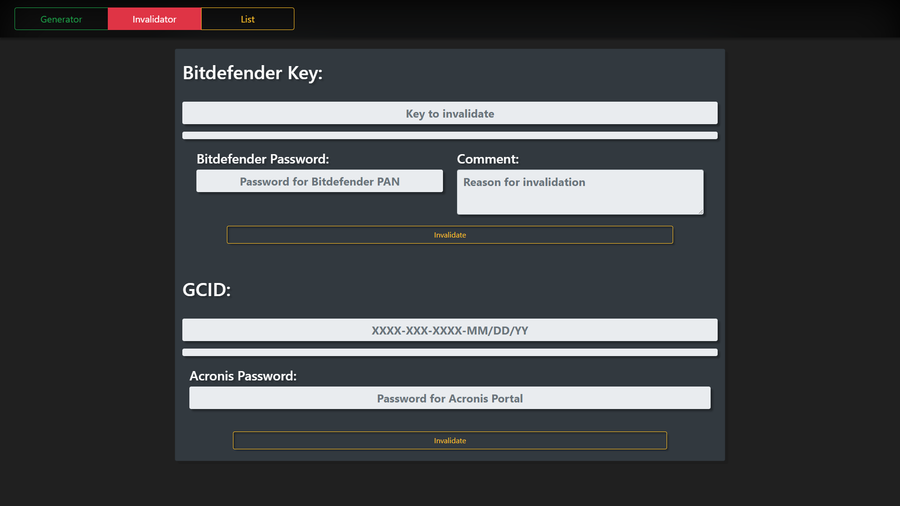
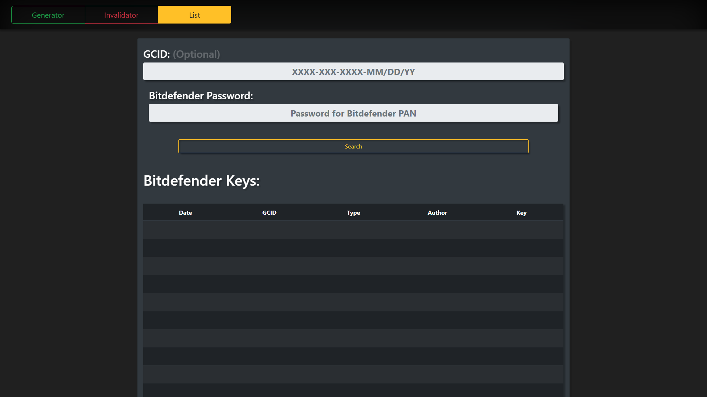
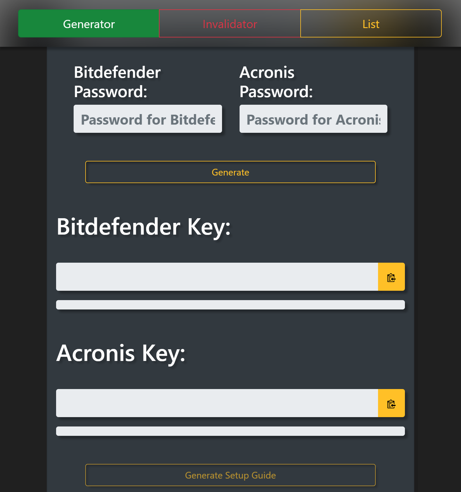

Here's a screenshot of the generator   

##
Some of it's features include a "popover", which help you type in the GCID exactly as it shows up on the receipt. As well, the generator automatically inserts dashes and slashes when typing, but not when deleting or backspacing.   

##
While waiting for your key, you can view the animated progress bars. Once your key or keys have finished generating, you can click on the clipboard icon to copy them to your clipboard. As well, you can click on "Generate Setup Guide" to create a setup guide identical to the one generated by AFK.   

##
The generator also has the ability to INVALIDATE keys that have been previously made.   

##
It also has a search function, which you can use to find a Bitdefender key that has been previously made.   

##
Thanks in part to Bootstrap, the generator is not only mobile friendly, but scales nicely with any screen size.   

